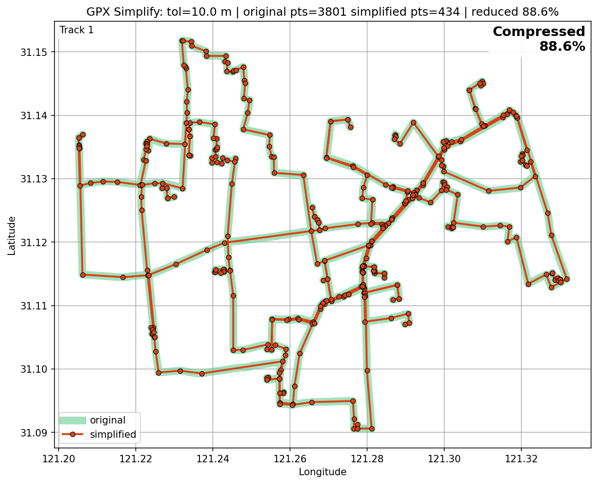
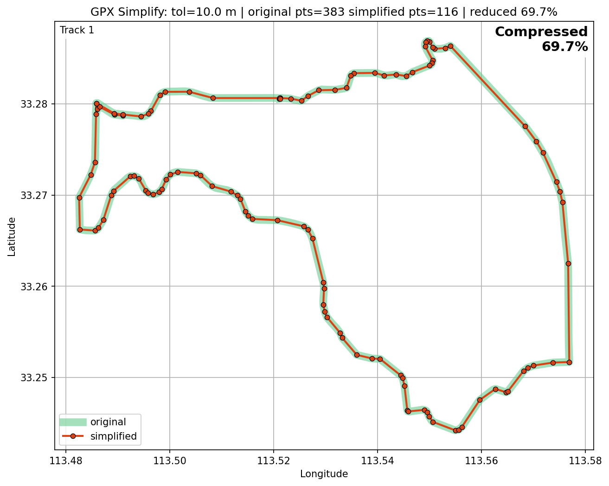
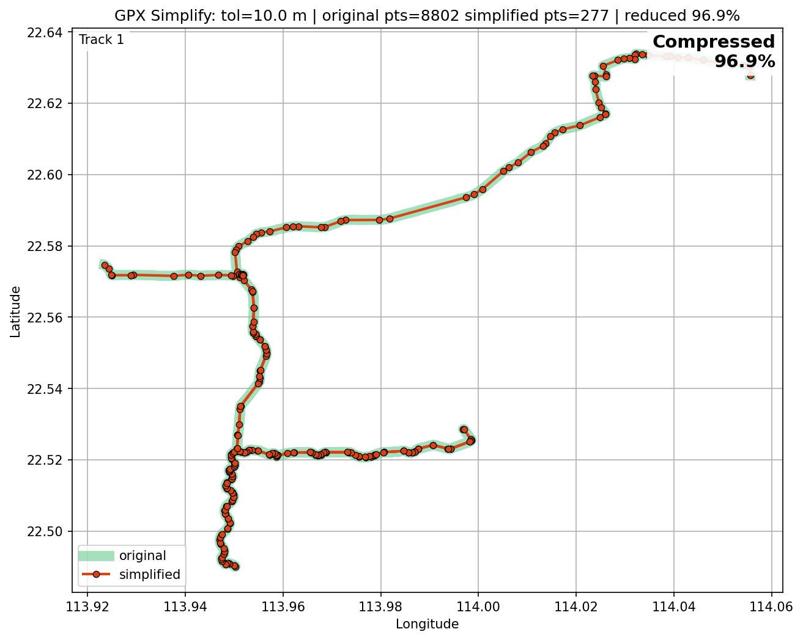
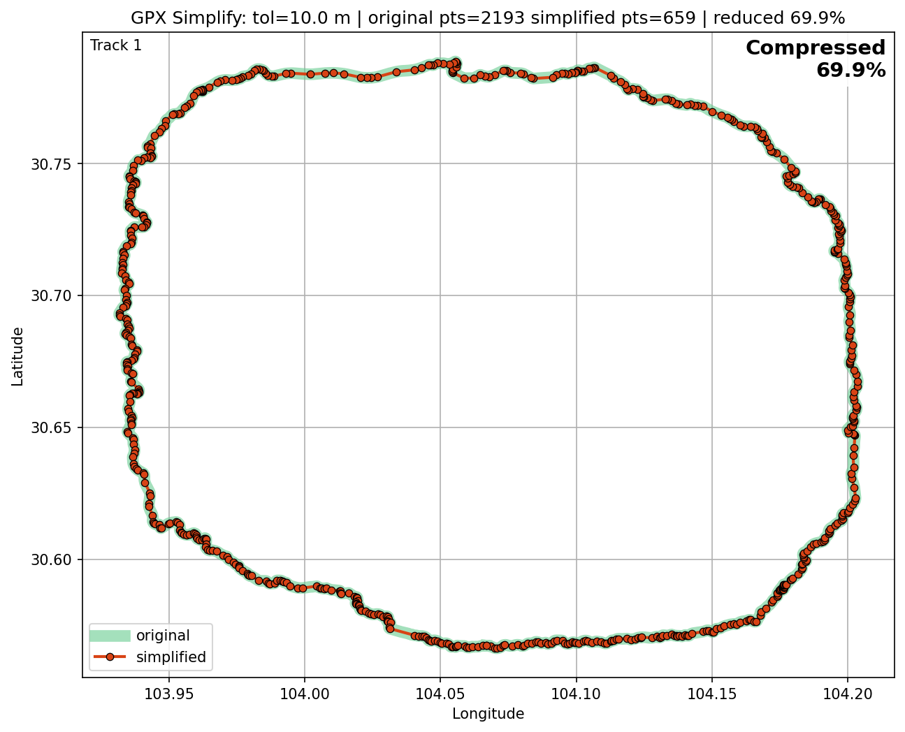
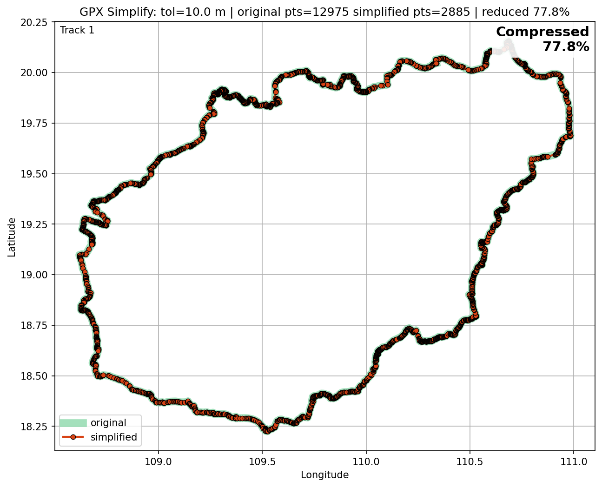
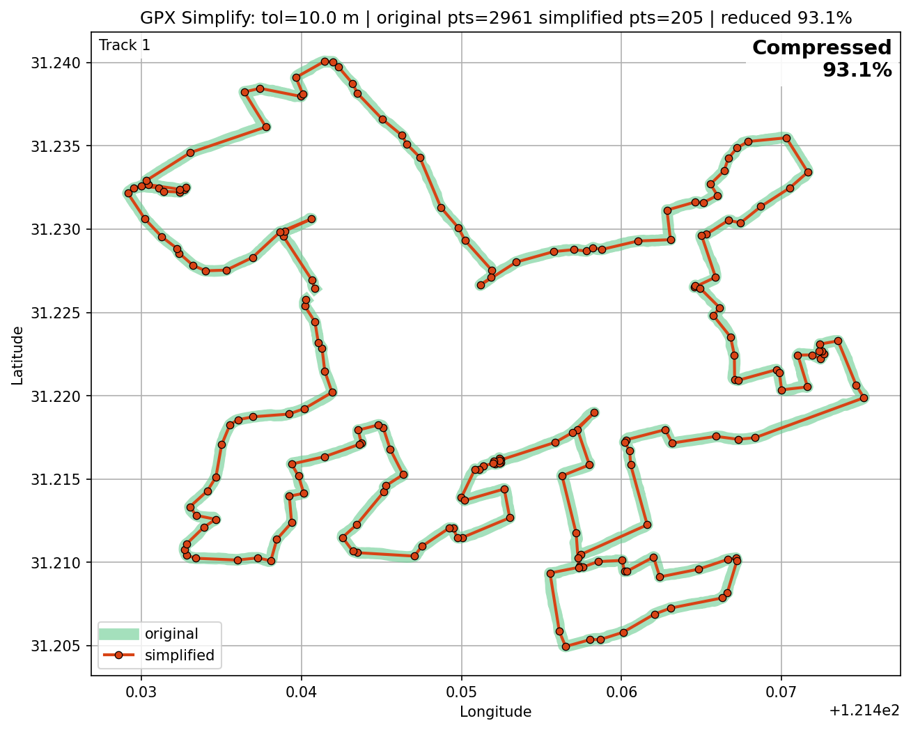

# c_gpx_lib

Minimal GPX parser and Douglas–Peucker simplification example.

## Overview

Small C library and an example application to parse GPX files in a streaming
fashion and simplify track segments using Douglas–Peucker. The repo includes
a demo build, sample GPX files, and a Python verifier/visualizer to compare
original vs simplified tracks.

## Repository layout

- `demo_linux/` — Demo build and runnable example binary.
    - `demo_linux/build.sh`: build script that compiles the demo (`gpx_demo`).
    - `demo_linux/main_example.c`: example program that uses the C parser and simplifier.
    - `demo_linux/gpx_demo`: (compiled binary) demo executable — created by `build.sh`.
    - `demo_linux/run.sh`: convenience wrapper that builds then runs `gpx_demo` for all GPX files in `../gpx`.
- `src/` — Core library and implementation sources.
    - `src/ninja_gpx_parser.c` / `src/ninja_gpx_parser.h`: streaming GPX parser which invokes a segment callback.
    - `src/ninja_douglas_peucker.c` / `src/ninja_douglas_peucker.h`: Douglas–Peucker simplification implementation.
    - `src/ninja_output_writer.c` / `src/ninja_output_writer.h`: helpers to write simplified tracks and cache format.
    - `src/ninja_gpx_log.h`: lightweight logging macros.
- `verify/` — Python verification and visualization tools.
    - `verify/compress_gpx.py`: Python script that simplifies GPX files and creates comparison PNGs.
    - `verify/run.sh`: wrapper to run `compress_gpx.py` on all files in `../gpx` and collect outputs in `verify/`.
- `gpx/` — sample GPX files for testing.
- `img/` — example comparison PNGs generated by the verifier (see below).

## Building the C demo (Linux / WSL / macOS)

1. Change to the demo directory and run the build script:

```bash
cd demo_linux
./build.sh
```

2. After a successful build the demo binary `gpx_demo` will be created in
     `demo_linux/`. Example invocation:

```bash
./gpx_demo ../gpx/0001a72b.GPX --output 0001a72b_comp.GPX --tol 10
```

Notes for Windows (PowerShell): use `bash` from WSL or Git Bash, or compile
with an appropriate MinGW/MSYS toolchain.

## Running the C demo on all sample GPX files

From `demo_linux/` you can run the included helper to build and process all
files in the `../gpx` folder (handles both `.gpx` and `.GPX` suffixes):

```bash
./run.sh 10   # optional tolerance in meters (default 10)
```

Outputs will be written into `../gpx/` as `<basename>_comp.GPX`.

## Using the Python verifier / visualizer

The `verify/compress_gpx.py` script simplifies a GPX file and produces a
comparison PNG. It requires `gpxpy`, `matplotlib`, and `numpy`.

Install dependencies (recommended in a virtualenv):

```bash
python3 -m venv .venv
source .venv/bin/activate
pip install gpxpy matplotlib numpy
```

Run the verifier for a single file:

```bash
cd verify
python3 compress_gpx.py ../gpx/0001a72b.GPX --output 0001a72b_comp.GPX --tolerance 10
```

Or process all sample GPX files and write outputs into `verify/` using the
included wrapper (handles `.gpx` and `.GPX`):

```bash
./run.sh 10
```

This will produce simplified GPX files named `<basename>_comp.GPX` in the
`verify/` directory and a comparison PNG per file named
`comparison_<basename>_comp.png`.

## Cache format and design notes

- The parser streams GPX and invokes a callback per `<trkseg>` to limit
    peak memory usage on constrained systems.
- The optional binary cache format used by the example is:

```txt
[uint32 name_len][name bytes][uint32 point_count][(lon_i,lat_i,ele_i)*]
```

where `lon_i`/`lat_i` are `int32` scaled by 1e7 and `ele_i` is `int32`
scaled by 1000 (millimeters).

## Example: compile manually

```bash
gcc -O2 -o gpx_simplify demo_linux/main_example.c src/ninja_gpx_parser.c src/ninja_douglas_peucker.c src/ninja_output_writer.c -lm
```

## Image comparisons (img/)

The `img/` directory contains visualization images produced by the Python
verifier showing the effect of the Douglas–Peucker simplification. Each
image compares the original track (subtle, thicker line) with the
simplified track (marker + line), and includes statistics such as the
original and simplified point counts and the percentage reduction.

Current example images included in `img/`:

- 
-    
- 
- 
- 
-       
- 

To generate new comparison images, run `verify/compress_gpx.py` (see the
[Using the Python verifier / visualizer](#using-the-python-verifier--visualizer) section). Place resulting PNGs in
the `img/` folder to keep sample visual outputs together with the repo.

## Contact

This is a minimal example project intended for testing and embedded
experimentation. Any issues feel free to open a GitHub issue or contact ejngnng@163.com.
